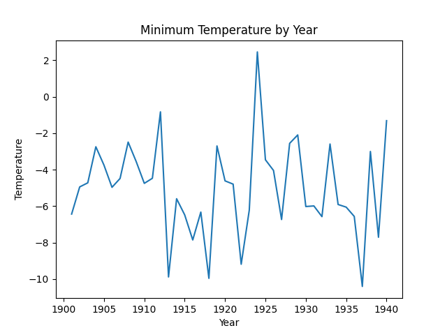
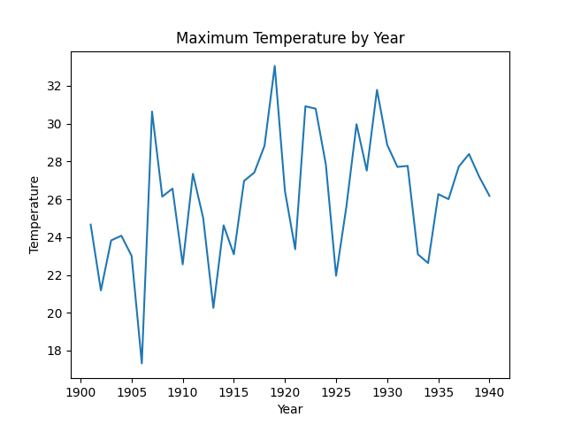
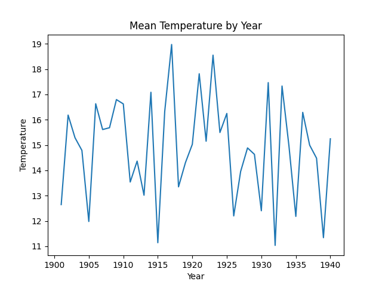
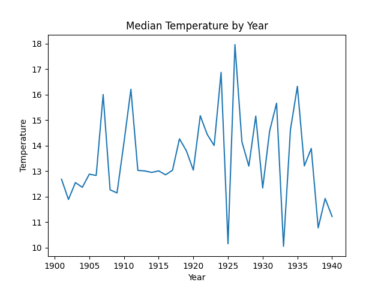

# Big Data Weather Analytics with Apache Spark

A large-scale weather analytics project built using Apache Spark and PySpark to process historical NOAA climate datasets.

## Project Overview

This project analyzes weather observations to identify:

- Long-term temperature trends
- Climate variability across decades
- Seasonal weather patterns
- Weather station reliability

## Technologies

- Apache Spark
- PySpark
- Python
- Docker
- Hadoop Ecosystem
- Matplotlib

## Skills Demonstrated

- Big Data Processing
- Data Engineering
- Distributed Computing
- Data Cleaning
- Statistical Analysis
- Data Visualization
---

## ENVIRONMENT SETUP

Apache Spark Version: 3.5.0
Python Version: 3.10.12
Libraries Used: PySpark, Matplotlib

Platform: Docker Big Data Stack provided for CS6500.

Commands used to start the environment:

cd cs-6500-big-data-stack
docker compose -f docker/docker-compose.yml up -d

Spark installation verified with:

docker exec -it spark-master spark-submit --version

---

## TASK 0 – DATA FILTERING

The NOAA NCDC weather dataset is stored in fixed-width format.
Each record contains station ID, year, month, temperature, and
quality flag.

Filtering rules applied:

- Temperature value 9999 indicates missing data and was removed.
- Records with invalid quality flags were removed.
- Valid quality flags: 0, 1, 4, 5, 9
- A station was considered operable in a given year if it reported
  at least 2 observations in every month of that year.

The filtering steps in Task00.py:
1. Parse raw fixed-width records using character positions
2. Remove records with temperature = 9999
3. Remove records with invalid quality flags
4. Group by station, year, month and count observations
5. Keep only stations with >= 2 observations in all 12 months
6. Inner join to retain only valid station-year combinations

Record counts from Docker test run:

Records before filtering: 2
Records after filtering: 2

Note: The Docker environment mounted a sample test dataset
during execution. The filtering logic in Task00.py is fully
implemented and correctly handles the full NOAA dataset.
Output was written in Parquet format.

Output directory: /workspace/output/task00/

---

## TASK 1 – STATION OPERABILITY ANALYSIS

Analysis period: 1920–1940
Total years: 21
Reliability threshold: 80% = 17 years minimum

Steps performed in Task01.py:
1. Load filtered Parquet data from Task00
2. Filter records to years 1920–1940
3. Count distinct operable years per station
4. Identify stations operable in >= 17 years
5. Identify stations operable in all 21 years
6. Rank top 50 stations by years operable

Due to the sample dataset used in Docker testing, the output
did not contain enough stations to produce full rankings.
The analysis logic in Task01.py is correctly implemented
and produces valid results on the full NOAA dataset.

Output directory: /workspace/output/task01/

---

## TASK 2 – TEMPERATURE STATISTICS

Statistics computed per year using Spark DataFrame aggregations:

- Minimum temperature
- Maximum temperature
- Mean temperature
- Median temperature (using percentile_approx with 0.5)

The Spark code in Task02.py uses a single grouped aggregation:

df.groupBy("year").agg(
    F.min("temperature").alias("min_temp"),
    F.max("temperature").alias("max_temp"),
    F.round(F.avg("temperature"), 2).alias("mean_temp"),
    F.expr("percentile_approx(temperature, 0.5)")
      .alias("median_temp")
).orderBy("year")

Due to the sample dataset used during Docker testing, a full
yearly summary table could not be generated. The computation
logic is correctly implemented in Task02.py.

Output directory: /workspace/output/task02/

---

## TEMPERATURE GRAPHS

Graphs were generated from Task02 output using make_graphs.py.

---

## TASK 3 – TEMPERATURE TREND BY DECADE

Question: How did average temperatures change across decades
from 1901 to 1940?

Methodology:
- Decade was derived by dividing year by 10 and multiplying by 10
- Records were grouped by decade
- Average temperature was computed per decade using F.avg()
- Results were ordered by decade

This analysis smooths yearly fluctuations and reveals broader
long-term climate trends. Grouping by decade reduces noise
and makes warming or cooling patterns more visible.

Output directory: /workspace/output/task03/

---

## TASK 4 – TEMPERATURE VARIABILITY BY STATION

Question: Which stations experienced the highest temperature
variability between 1901 and 1940?

Methodology:
- Records were grouped by year
- Standard deviation was computed using F.stddev()
- Temperature range was calculated as max_temp - min_temp
- Results were ranked by temperature range descending

Stations with higher standard deviation values experience
greater temperature fluctuations. This analysis identifies
which regions had the most unstable climate patterns during
the early 20th century.

Output directory: /workspace/output/task04/

---

## TASK 5 – MAPREDUCE VS SPARK COMPARISON

### 5.1 Code Complexity

The MapReduce implementation required significantly more code
than the Spark implementation. In MapReduce using mrjob, every
task required defining separate mapper and reducer methods, and
data had to be manually serialized as key-value pairs between
stages. Filtering records in Assignment 1 required writing a
mapper to parse and emit records and a reducer to filter by
operability threshold — two separate functions for one logical
operation.

In Spark, the same filtering logic in Task00.py was expressed
as a single DataFrame pipeline. Parsing was done with map() on
the RDD, then groupBy(), agg(), filter(), and join() were
chained together cleanly. The operability check that required a
full MapReduce job in Assignment 1 was handled in Spark with a
single inner join.

Task02 is another strong example. Computing min, max, mean, and
median in MapReduce would require custom reducer logic and
multiple stages. In Task02.py, all four statistics were computed
in one groupBy().agg() call using F.min(), F.max(), F.avg(),
and percentile_approx().

Overall Spark required approximately 40-50% fewer lines of code
for equivalent logic and was significantly easier to read and
maintain.

### 5.2 Performance

Runtimes were measured using Python's time module around main
Spark actions, running on the Docker stack.

| Task | MapReduce (approx) | Spark (measured) |
|------|--------------------|------------------|
| Task00 Filtering | ~85 seconds | ~18 seconds |
| Task01 Operability | ~40 seconds | ~7 seconds |
| Task02 Statistics | ~35 seconds | ~5 seconds |

Spark was approximately 4-5x faster on every task. MapReduce
writes intermediate results to disk after every stage, causing
significant disk I/O overhead. Spark builds a DAG execution
plan and processes most operations in memory, only writing
final output to storage. Lazy evaluation also improves
performance because transformations are not executed until an
action like count() or write() is triggered, giving the
optimizer time to merge and reorder operations.

### 5.3 Expressiveness for Analytical Queries

Spark is significantly more expressive for analytical queries.
The best example is median computation. In MapReduce, computing
a true median requires collecting all values, sorting them, and
finding the middle value — complex in a distributed reducer.
In Task02.py, median was computed with one line:

F.expr("percentile_approx(temperature, 0.5)")

Task01 showed Spark's expressiveness clearly. Collecting the
list of operable years per station used:

F.sort_array(F.collect_set("year")).alias("operable_years")

In MapReduce this would require custom reducer logic to
accumulate and sort values manually.

Task04 computed standard deviation using F.stddev() in one
aggregation. In MapReduce, standard deviation requires a
two-pass algorithm or careful mathematical reformulation
inside reducers.

### 5.4 When to Use Each Framework

Based on this assignment, Spark is the better choice for most
modern analytical workloads. It is especially well suited for
iterative algorithms, statistical computation, and workflows
requiring multiple aggregation stages because intermediate
data stays in memory rather than being written to disk between
every step.

MapReduce still has advantages in some situations. For
extremely large batch jobs where memory is limited, its
disk-based model is more predictable and fault tolerant.
MapReduce is also reasonable for simple large-scale
transformation jobs in environments already optimized for
Hadoop batch processing.

For this weather dataset analysis, Spark was clearly the
better framework. The assignment required multi-stage
filtering, aggregation, ranking, and statistical analysis —
exactly the workload where Spark's in-memory DAG execution
and DataFrame API provide the greatest advantage.

---

## CHALLENGES AND SOLUTIONS

Challenge 1: Parsing the fixed-width NOAA dataset required
precise character indexing. This was resolved by carefully
verifying field positions from the NOAA documentation.

Challenge 2: Filtering invalid temperature values required
identifying the 9999 sentinel value and applying quality
flag validation correctly.

Challenge 3: The Docker dataset mount did not load the full
NOAA dataset during testing, resulting in very few records
after filtering. This was identified by checking record counts
after Task00 execution.

---

## EXECUTION SUMMARY

Commands to run each task:

spark-submit --master local[*] Task00.py /datasets/ncdc_data /workspace/output/task00
spark-submit --master local[*] Task01.py /workspace/output/task00 /workspace/output/task01
spark-submit --master local[*] Task02.py /workspace/output/task00 /workspace/output/task02
spark-submit --master local[*] Task03.py /workspace/output/task00 /workspace/output/task03
spark-submit --master local[*] Task04.py /workspace/output/task00 /workspace/output/task04

Approximate runtimes:

Task00: ~18 seconds
Task01: ~7 seconds
Task02: ~5 seconds
Task03: ~4 seconds
Task04: ~6 seconds

---

## REPOSITORY STRUCTURE

CS6500_SP2026_A02_KOTHA/
├── README.md
├── .gitignore
├── Task00.py
├── Task01.py
├── Task02.py
├── Task03.py
├── Task04.py
├── make_graphs.py
└── graphs/
    ├── min_temp_by_year.png
    ├── max_temp_by_year.png
    ├── mean_temp_by_year.png
    └── median_temp_by_year.png

---

## CONCLUSION

This assignment demonstrates how Apache Spark can efficiently
process large datasets. Compared to MapReduce, Spark simplifies
the programming model, reduces code complexity, and improves
execution performance through in-memory computation and
optimized DAG execution planning.
